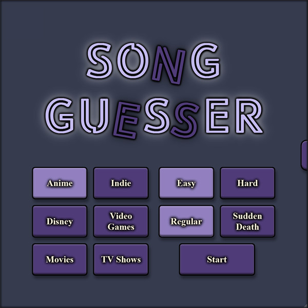
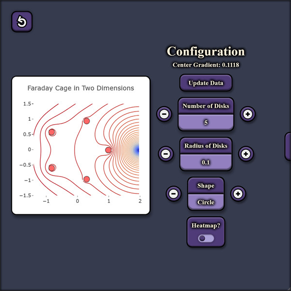
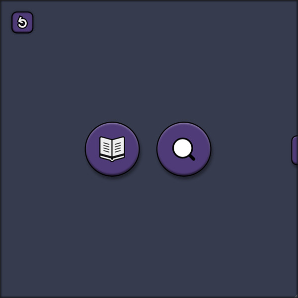

## Intro

Welcome, here you can find my portfolio website (available online at https://portfolio-lyonsxiis-projects.vercel.app/), which consists of a few projects I've been working on recently. Feel free to take a look at the source code, or click on the link and try it out for yourself.

The site is complete with transitions, adjustable settings and themes, and works both desktop and mobile.

The live site is deployed using Vercel for the frontend, with the backend consisting of a combination Render, and Neon to handle the PostgreSQL database.

## Projects

### 🎵 Song Guesser Game
A browser-based game that challenges the user to guess songs based on short clips. Features:
- Six different song categories
- Two difficulty levels
- Score tracking and fun visual effects

### 🧲 Faraday Cage 2D Simulator
An interactive mathematical visualization of how the strength of a Faraday cage is affected by adjusting wire thickness and the number of wires used.
- Visualisation created using Plotly
- Calculated in browser
- Adjustable parameters (number of disks, disk radius)

### 📊 ML Author Analysis Dashboard
A machine learning dashboard analyzing authors' writing styles using machine learning.
- Live charts and metrics
- Compare multiple authors side-by-side
- Built with React + D3/Chart.js

## 🎥 Demo

> You can also [view a short walkthrough GIF](./assets/demo.gif) right here in the README.

## Live Site
[Visit the live site here](https://portfolio-lyonsxiis-projects.vercel.app/)
Unfortunately due to the computational intensity of this machine learning method, prediction of new text is not available in the live demo. Feel free to download the code and run it locally if you'd like to give it a try.

## 🛠️ Tech Stack
- React + Styled Components
- Express + Flask
- PostgreSQL

## 📬 Contact
Feel free to reach out:
- ✉️ [michael.lyons@gmail.com](michael.lyons@gmail.com)